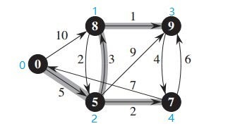

# Graph

- [x] 从文件中导入图
- [x] 基于Fibonacci 堆实现的Dijkstra算法
- [x] 所有节点对最短路径的Johnson算法(不支持负权值边)

### 用例

 

```
eg.txt {source dest weight}

0 1 10
0 2 5
1 2 2
1 3 1
2 1 3
2 3 9
2 4 2
3 4 4
4 0 7
4 3 6
```
```c++
#include <iostream>
#include <list>
#include "graph.h"

int main(void){
	Graph g("eg.txt");
	g.dijkstra(0);	//起点为0
 	std::list<int> res = g.shortestpath(0, 1); //0->1的最短路
  	for(auto i:res){
      std::cout << i << " ";
  	}
  	std::cout << "path weight: " << g.nodePriority(1) << std::endl;
  	return 0;
}
```

```
output
0 2 1
path weight: 8
```